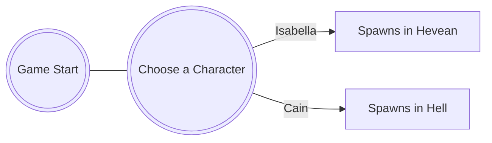

# Path of Agony

Jogo super fixe By Rodrigo Santos

### [Website](http://pathofagony.cu)

##### Game Platforms

* PC's
* Ps4/Ps5
* Nintendo Switch
* Xbox
  
## Solo Player Game With Multiplayer [DLC]

### System Requeriments

* Minimun:
  * Sistema Operativo *: Windows 7 (64bit)

  * Processador: Intel Core 2 Duo E5200
  * Memória: 4 GB de RAM
  * Placa gráfica: GeForce 9800GTX+ (1GB)
  * DirectX: Versão 10
  * Espaço no disco: Requer 9 GB de espaço livre
  * Notas adicionais: 1080p, 16:9 recommended

* Recommened:
  * Sistema Operativo: Windows 10 (64bit)

  * Processador: Intel Core i5
  * Memória: 8 GB de RAM
  * Placa gráfica: GeForce GTX 560
  * DirectX: Versão 11
  * Espaço no disco: Requer 9 GB de espaço livre
  * Notas adicionais: 1080p, 16:9 recommended

----------------

##### Items Available as of Now

* Hell's Version

   * Demonic FlintLock

   * Cerberus Gloves

   * Scythe of the Grim Reaper

   * Arch-Demon Eye

* Heaven's Version

   * Shield of the Fallen

   * Angelic Mase
   * Axe of the Angel Jack

   * Wings Of an Arch-Angel

   * Blessing Potions

### Choosing a Character FlowChart

